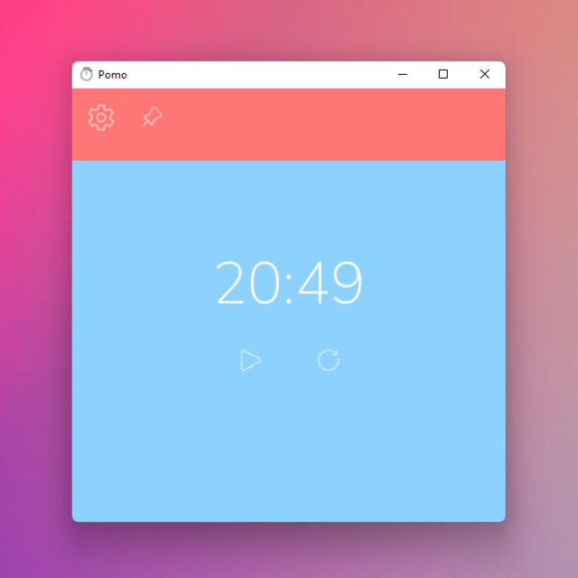
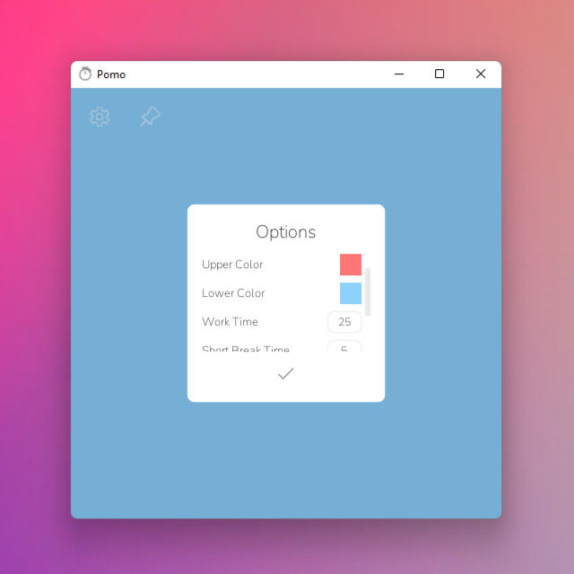

  
  <h1 align="center">Pomo</h1>

An elegant pomodoro timer.

## Download
You can download Pomo [here](https://github.com/ierea/Pomo/releases/).

## Web App
Pomo is also available in your browser as a Progressive Web App [here](https://ierea.github.io/Pomo/).

## About
Pomo is written in C# with the Godot Engine.

## Screenshots

## License
Pomo's code is free and open source, licensed under the [GNU General Public License v3.0](https://opensource.org/licenses/GPL-3.0).  
Assets used in Pomo are credited in [CREDITS.md](CREDITS.md).